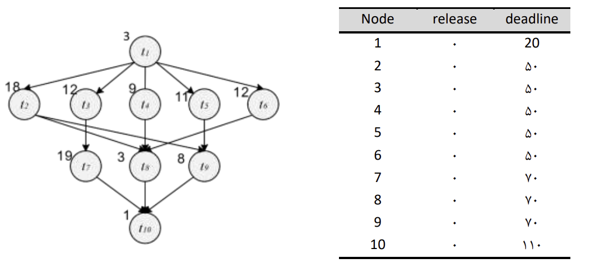
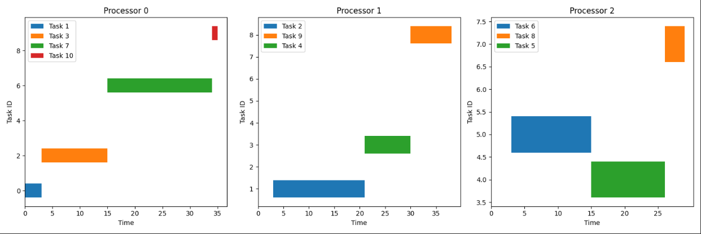

# P-EDF (Partitioned Earliest Deadline First)

This project is a scheduler algorithm based on P-EDF on a multi-core system. You can change the processor count in main.py file.

Here is a sample output using 10 tasks with below graph dependencies.

## main idea
